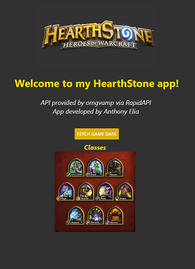
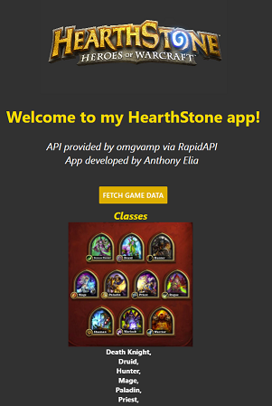
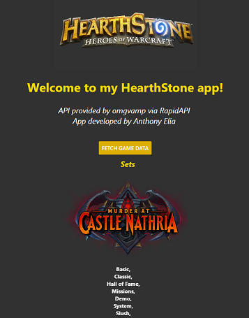

# hearthstone_fetch

A mobile app done in React Native that fetches hearthstone data.
Utilizes an API provided by OmgVamp to fetch details of the HearthStone card game.

Obtains details on classes, sets, factions, rarities, types and races.

Works on iOS, Android, and Web

## Before Fetch

## After Fetch

## Slider to view different details 

### **Dependencies on Expo, React-Native, and Redux.**
